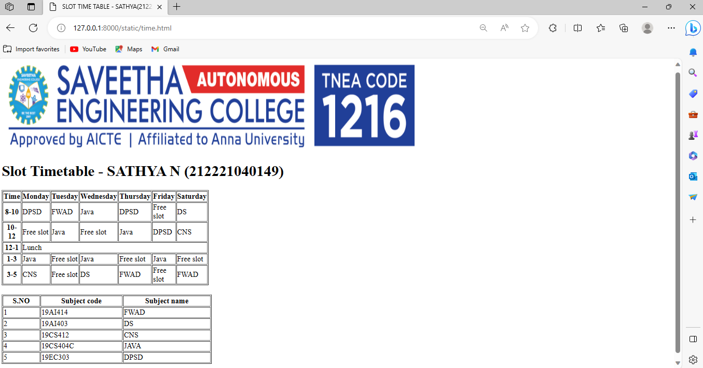

# Ex03 Time Table
Date : 09/10/2003

## AIM
To write a html webpage page to display your slot timetable.

## ALGORITHM
### STEP 1
Create a Django-admin Interface.

### STEP 2
Create a static folder and inert HTML code.

### STEP 3
Create a simple table using ```<table>``` tag in html.

### STEP 4
Add header row using ```<th>``` tag.

### STEP 5
Add your timetable using ```<td>``` tag.

### STEP 6
Execute the program using runserver command.

## CODE
```
<html>
    <head>
        <title>SLOT TIME TABLE - SATHYA(21222140149)</title>
    </head>
    <body>
        
        <h1>Slot Timetable - SATHYA N (212221040149)</h1>
    <table cellspacing="2" border="1" style="margin-bottom: 20px;" width="400" height="200">
        <tr>
            <th>Time</th>
            <th>Monday</th>
            <th>Tuesday</th>
            <th>Wednesday</th>
            <th>Thursday</th>
            <th>Friday</th>
            <th>Saturday</th>
        </tr>
        <tr>
            <th>8-10</th>
            <td>DPSD</td>
            <td>FWAD</td>
            <td>Java</td>
            <td>DPSD</td>
            <td>Free slot</td>
            <td>DS</td>
        </tr>
        <tr>
            <th>10-12</th>
            <td>Free slot</td>
            <td>Java</td>
            <td>Free slot</td>
            <td>Java</td>
            <td>DPSD</td>
            <td>CNS</td>
        </tr>
        <tr>
            <th>12-1</th>
            <td colspan="6"> Lunch</td>
        
        </tr>
        <tr>
            <th>1-3</th>
            <td>Java</td>
            <td>Free slot</td>
            <td>Java</td>
            <td>Free slot</td>
            <td>Java</td>
            <td>Free slot</td>
        </tr>
        <tr>
            <th>3-5</th>
            <td>CNS</td>
            <td>Free slot</td>
            <td>DS</td>
            <td>FWAD</td>
            <td>Free slot</td>
            <td>FWAD</td>
        </tr>
    </table>
    <table border="1" style="margin-bottom: 20px;" width="450" height="100">
        <tr>
            <th>S.NO</th>
            <th>Subject code</th>
            <th>Subject name</th>
        </tr>
        <tr>
            <td>1</td>
            <td>19AI414</td>
            <td>FWAD</td>
        </tr>
        <tr>
            <td>2</td>
            <td>19AI403</td>
            <td>DS</td>
        </tr>
        <tr>
            <td>3</td>
            <td>19CS412</td>
            <td>CNS</td>
        </tr>
        <tr>
            <td>4</td>
            <td>19CS404C</td>
            <td>JAVA</td>
        </tr>
        <tr>
            <td>5</td>
            <td>19EC303</td>
            <td>DPSD</td>
        </tr>
    </table>
</body>
</html>
```

## OUTPUT



## RESULT
The program for creating slot timetable using basic HTML tags is executed successfully.
 